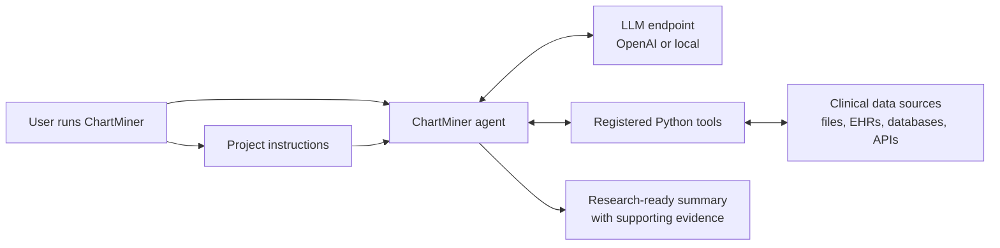

# ChartMiner

ChartMiner is a small framework for using an AI agent to review clinical records
and extract research-ready summaries.

It is designed for clinical and medical research workflows where a team needs to
review many records for the same question. That may mean checking one document
per patient, or it may mean searching through hundreds of notes, reports,
messages, and other clinical records to find the few details that matter: the
needle in a haystack.

ChartMiner does not replace clinical judgment. It is a clinical record review
assistant: it reads the records you provide, follows your project instructions,
and returns a structured summary that should be reviewed by a qualified person.

## What ChartMiner Does

For each project, ChartMiner:

1. Reads a list of patient or record IDs.
2. Retrieves the clinical records for each ID.
3. Applies the instructions written for that project.
4. Produces a concise analysis with evidence from the records.

The included `biopsy-analysis` project provides a small reference workflow.

## How It Works



ChartMiner gives the LLM project instructions and a set of registered tools. The
LLM decides when to call those tools, uses the returned clinical data, and writes
the final analysis.

## How It Is Organized

ChartMiner uses a folder-based structure so each research question can live in
its own project directory.

```txt
chart-miner/
  main.py
  tools/
    getids.py
    getEHR.py
    getCloudpathologyDemographics.py
  projects/
    biopsy-analysis/
      instructions.md
      ids
      records/
        record_id_1/
          document_1.txt
          document_2.txt
```

Each project contains:

- `instructions.md`: the research question and output format.
- `ids`: one patient or record ID per line.
- `records/`: a folder of source documents, grouped by ID. This is just a reference implementation where all the data is on file system. If your ID and EHR retrieval tools are talkig to external systems, this would not be needed.

The included file-based tools read from this structure. If your records live in
another system, such as an EHR export, database, or document store, you can add a
new Python file in `tools/`. ChartMiner automatically registers tools from that
folder.

## Reference Project

The included reference project is:

```bash
projects/biopsy-analysis
```

This project is intentionally small so new users can see the full workflow before
connecting ChartMiner to real data.

## Setup

### 1. Create a Python environment

```bash
python -m venv .venv
source .venv/bin/activate
```

If you use `pyenv`, the repository includes a `.python-version` file:

```bash
pyenv install --skip-existing $(cat .python-version)
```

### 2. Install dependencies

```bash
pip install -r requirements.txt
```

### 3. Choose a model provider

ChartMiner can use OpenAI directly or any local/server model that provides an
OpenAI-compatible API.

Create a `.env` file in the repository root.

For OpenAI:

```txt
OPENAI_API_KEY=your_api_key_here
CHART_MINER_MODEL=your_preferred_model
```

For an OpenAI-compatible endpoint:

```txt
CHART_MINER_BASE_URL=http://localhost:11434/v1
CHART_MINER_API_KEY=ollama
CHART_MINER_MODEL=your_preferred_model
CHART_MINER_OPENAI_API=chat_completions
```

`CHART_MINER_BASE_URL` may point to a local model server or an internal model
gateway. When this is set, ChartMiner defaults to the OpenAI-compatible
chat-completions API.

Configuration variables:

- `CHART_MINER_MODEL`: model name to use.
- `CHART_MINER_BASE_URL`: OpenAI-compatible API base URL. `OPENAI_BASE_URL` is
  also supported.
- `CHART_MINER_API_KEY`: API key for the endpoint. `OPENAI_API_KEY` is also
  supported.
- `CHART_MINER_OPENAI_API`: `chat_completions` or `responses`. Defaults to
  `chat_completions` when `CHART_MINER_BASE_URL` is set.
- `CHART_MINER_ENABLE_TRACING`: set to `true` only if you want Agents SDK tracing
  enabled for a custom endpoint.

## Local LLM With Ollama

Ollama can serve local models through an OpenAI-compatible API. This is useful
when clinical research data should stay within a local or institution-controlled
environment.

Ollama's OpenAI-compatible API documentation is available at:

```txt
https://docs.ollama.com/openai
```

1. Install Ollama from the official download page:

```txt
https://ollama.com/download
```

2. Download and run a local model:

```bash
ollama run gpt-oss:20b
```

3. In another terminal, confirm Ollama is serving requests:

```bash
curl http://localhost:11434/v1/models
```

4. Configure ChartMiner in `.env`:

```txt
CHART_MINER_BASE_URL=http://localhost:11434/v1
CHART_MINER_API_KEY=ollama
CHART_MINER_MODEL=gpt-oss:20b
CHART_MINER_OPENAI_API=chat_completions
```

5. Run ChartMiner:

```bash
python main.py -p biopsy-analysis
```

Notes:

- Local models vary in speed, context length, tool-calling quality, and clinical
  reasoning quality.
- Review outputs carefully before using them for research decisions.
- For large clinical record sets, choose a model and machine with enough context
  capacity and memory for your workload.

## Run the Reference Project

```bash
python main.py -p biopsy-analysis
```

You can also run a project by giving the full path:

```bash
python main.py -p projects/biopsy-analysis
```

Optional:

```bash
python main.py -p biopsy-analysis --max-turns 20
```

`--max-turns` limits how many steps the agent can take while using tools and
producing the final answer.

## Create a New Clinical Record Review Project

1. Create a folder under `projects/`.

```bash
mkdir -p projects/my-study/records
```

2. Add an `ids` file.

```txt
record_id_1
record_id_2
record_id_3
```

3. Add records for each ID.

```txt
projects/my-study/records/record_id_1/document_1.txt
projects/my-study/records/record_id_1/document_2.txt
projects/my-study/records/record_id_2/document_1.txt
```

4. Write `instructions.md`.

Good instructions should say:

- which tools to use, usually `getIds` and `getEHR`,
- what question or task ChartMiner should focus on,
- what information to look for in the clinical records,
- how to handle uncertainty, and
- what final format you want.

Template:

```md
# My Study

Use `getIds` to retrieve the patient IDs.
For each ID, use `getEHR` to retrieve the patient's clinical records.

Goal: review the available clinical records for each patient and extract the
information relevant to this project.

For each patient, report:

- patient ID
- key findings relevant to the project question
- supporting evidence from the clinical records
- any uncertainty or missing information

Finish with the requested summary format.
```

## Tools

ChartMiner needs at least two tools:

- `getIds`: returns the list of IDs for the active project.
- `getEHR`: returns the clinical records for one ID.
- `getCloudpathologyDemographics`: fetches patient demographics from the public
  Cloudpathology bill API for a bill ID.

The default tools are file-based and live in `tools/`.

You can add more tools by placing a Python file in `tools/`. Public functions in
that folder are registered automatically with the agent. This lets technical
teams connect ChartMiner to local files first, then later to more advanced data
sources without changing how clinical users write project instructions.

## Data and Privacy

Use de-identified data whenever possible. Before using real clinical records,
make sure your team has the required approvals, data use agreements, and security
controls for your institution.

ChartMiner sends the text it analyzes to the configured model endpoint. Do not
run protected health information through this tool unless that use is permitted
under your organization's policies and agreements.

## Current Status

ChartMiner currently provides:

- one async OpenAI Agents SDK agent,
- automatic tool registration from `tools/`,
- file-based ID and clinical record retrieval,
- project-specific instructions,
- `.env` loading,
- support for OpenAI-compatible local or hosted model endpoints, and
- a small `biopsy-analysis` reference project.
